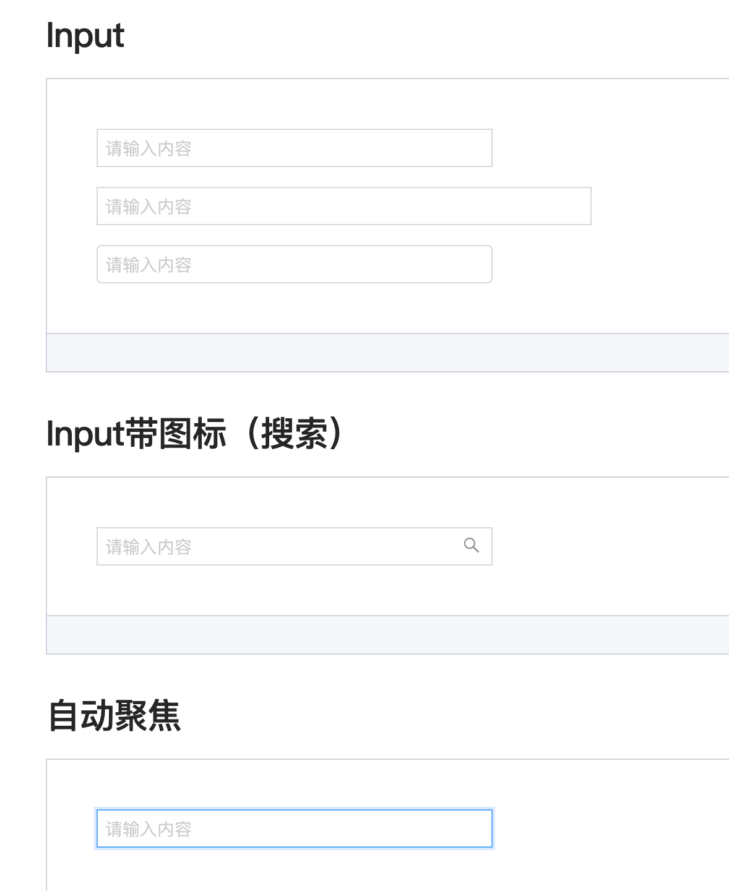
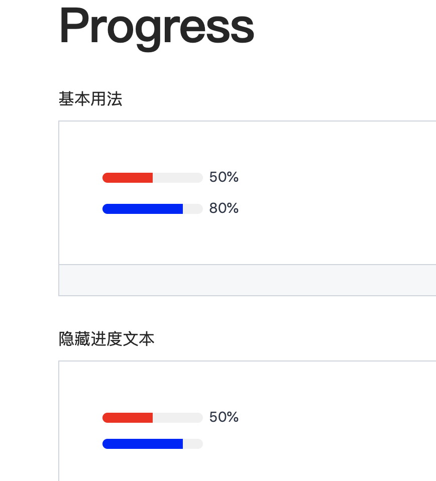
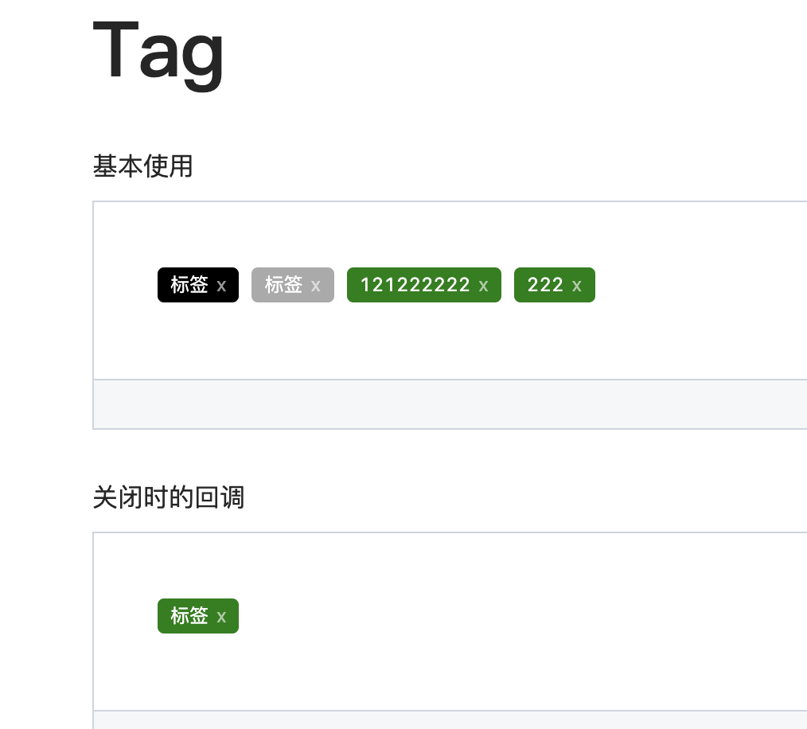

<!--
 * @Author: your name
 * @Date: 2020-02-22 22:01:08
 * @LastEditTime: 2020-02-26 11:32:29
 * @LastEditors: Please set LastEditors
 * @Description: In User Settings Edit
 * @FilePath: /cf-design/README.md
 -->
# cf-design——基于react的轻量级UI组件库
cf-design是笔者开发的基于react的轻量级组件库，目前不依赖任何第三方ui组件库，支持按需导入，可定制。官网地址website: [cf-design——基于react的轻量级UI组件库](https://liangchaofei.github.io/cf-design/)

如果觉得官网地址访问太慢，可以直接移步github地址：[cf-design——基于react的轻量级UI组件库](https://github.com/liangchaofei/cf-design)

目前已开发完成如下ui组件：
* Button 按钮组件
* Badge 徽标数组件
* Alert 警告提示组件
* Tag 标签组件
* Modal 轻量实用的模态窗组件


正在开发的组件：
* Process 进度条组件

后续会开发出更多优质轻量组件，敬请关注。

# 技术实现与版本
该组件库基于一下技术版本开发：
* react: 16.8.6
* react-dom: 6.8.6
* classnames

# 文档demo演示




# 使用

## 1.安装
``` js
npm install cf-design
```
或者用yarn安装
``` js
yarn add cf-design
```
## 2. 使用
``` jsx
import { 
  Button,
  Skeleton,
  Empty,
  Progress,
  Tag,
  Switch,
  Drawer,
  Badge,
  Alert
} from 'cf-design'
import { useState } from 'react'
import styles from './index.css'

export default function() {
  const [visible, setVisible] = useState(false)
  let show = () => { setVisible(true)}
  let close = () => { setVisible(false)}
  return (
    <div className={styles.normal}>
      <Button className={styles.btn}>default</Button>
      <Button className={styles.btn} type="warning">warning</Button>
      <Button className={styles.btn} type="primary">primary</Button>
      <Button className={styles.btn} type="info">info</Button>
      <Button className={styles.btn} type="pure">pure</Button>
      <Button className={styles.btn} type="primary" shape="circle">circle</Button>
      <Button className={styles.mb16} type="primary" block>primary&block</Button>
      <Button type="warning" shape="circle" block onClick={show}>circle&block</Button>
      <div className={styles.mb16}></div>
      <Badge text="ddd" status="warning">6666ngd</Badge>
      <div className={styles.mb16}></div>
      <Alert message="success tip" />
      <Alert message="success tip" type="success" />
      <Alert message="success tip" type="error" />
      <Alert message="success tip" type="info" />
      <Alert message="success tip" type="info" closable />
      <Alert message="success tip" description="skfjdsalajdfjadkfjaldfhjaskdn你好,欢迎光临" closable type="success" />
 
    </div>
  )
}

```


# 技术交流与反馈
微信（wechat）：cf825605688

欢迎提出更多issue以便让组件库更健壮

